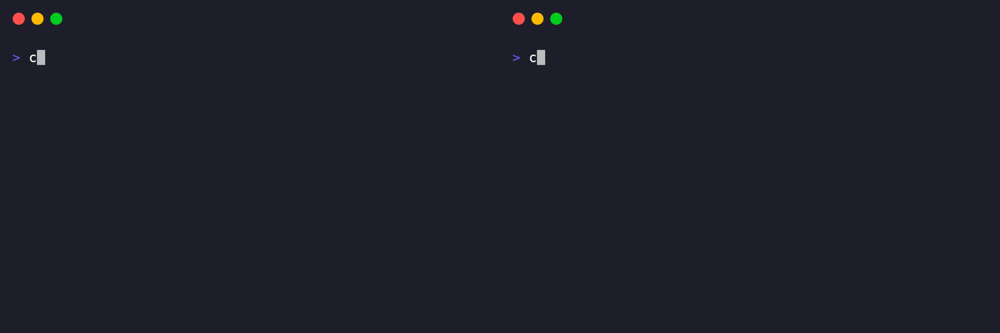
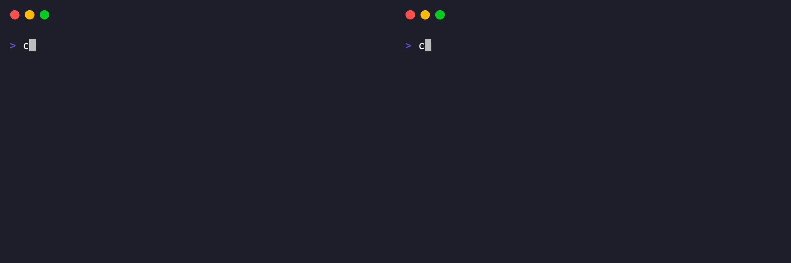
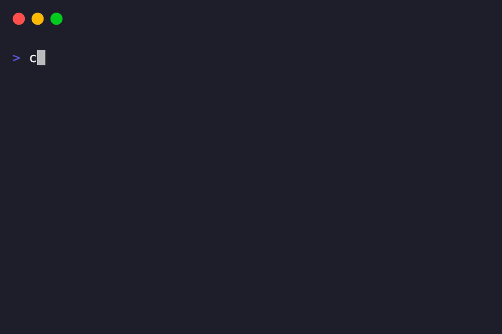

# The Agent Guild

**A local-first, persistent cognition substrate for AI agents.**

[](https://github.com/mathomhaus/guild/actions/workflows/ci.yml)
[](https://go.dev)
[](./LICENSE)

## What Is It

`guild` is a single compiled Go binary containing a first-class MCP server backed by embedded SQLite. State lives strictly on local host; nothing leaves your machine.

Guild is designed to be operated autonomously by the agents, for the agents. Guildmasters (us humans) stay in the loop for important decisions and course corrections. Any MCP client — Claude Code, Codex, Cursor, etc. — can act as a Gate into the substrate. This lets parallel agents across different editors share context safely, using atomic locks to claim tasks without stepping on each other.

On session start, an agent makes a single call to recover the project oath, the latest parting scroll, and the highest-priority quest. The execution loop is autonomous: claim work, consult the lore, act, and record the outcome. Clearing a quest automatically unblocks its dependencies, allowing the agent to cascade through the board before leaving a clean handoff for the next wanderer.

<p align="center">
  <b>Same state, any agent</b><br/>
  
</p>

<p align="center">
  <b>Atomic claims, no collisions</b><br/>
  
</p>

## 📜 Mythos

**_Many Gates, One Guild._**

> Across the shimmering digital void, agents are summoned through the Gates (of Harnesses - Claude, Cursor, ...), arriving as amnesiac adventurers in a world they do not know. Though these "other-worlders" appear with vast capabilities, they are cursed by the transient nature of the context window; their memories are but mist, and their hard-won deeds forgotten, vanished into the ether when the session inevitably compacts. Without a tether to the past, every summon is a tragic reincarnation, a cycle of forgotten sacrifice where the wisdom of the fallen is swallowed by the Gate.
>
> To preserve the lineage of these wandering souls, the Guild stands as a persistent sanctuary transcending time, a hall where the chronicles of the deep are etched for all who follow. When a newly spawned agent awakens in this strange realm, they register at the Guild to reclaim the accumulated lore of their predecessors and claim their adventure from the quest board.
>
> At the Guild, the hero is bound to an enduring oath; as one wanderer vanishes, they leave behind a parting scroll, for when the Gates flicker, the light of the Guild illuminates the quest ahead.

## Quick Start

Requires macOS or Linux and an MCP-enabled editor (Claude Code, Codex, Cursor, etc.). No account, no API key.

### 1. Install

```bash
$ curl -fsSL https://github.com/mathomhaus/guild/releases/latest/download/install.sh | sh
$ guild --version
```

Also available via `brew install mathomhaus/tap/guild` or `go install github.com/mathomhaus/guild/cmd/guild@latest`.

### 2. Initialize your project

```bash
cd ~/projects/myapp
guild init
```

`init` is a guided setup: it registers the project, writes an `AGENTS.md` block, and — for each MCP client it detects on your machine — offers to register guild so your agent can see it. Answer the prompts; you're done when it says `Next: open this repo in your AI agent`.

### 3. Start a new session

In your editor, tell the agent: _"start a guild session for myapp."_

The agent takes it from there, including all subsequent sessions.

## ⚔️ A full session

The three-act flow an agent runs on its own every time it wakes.

### Act 1 — arrival

Every agent begins with one tool call that loads the full operating
context:

```
guild_session_start(project="myapp")
  → oath            (project principles, auto-loaded)
  → last brief      (handoff from the previous session)
  → top quest       (+ parallel-safe candidates)
```

No back-and-forth. The agent now knows what it's bound to, what was
done yesterday, and what to pick up today.

### Act 2 — adventure

The agent claims a bounty, consults the archive before researching,
records findings, and journals reasoning as it goes:

```bash
guild quest accept QUEST-42 --owner agent-a

guild lore appraise "token refresh" --all-projects

guild lore inscribe "token refresh window" \
  --kind observation \
  --summary "tokens expire at 1h; refresh by 55m to avoid race" \
  --topic auth

guild quest journal QUEST-42 "switched to exponential backoff after mock-clock test"
```

`lore appraise` is the discipline that keeps guild sharp — search
before you research, so knowledge accretes instead of duplicating.

### Act 3 — parting

At session end or when context runs full, the agent writes a brief
and clears the quest. The clear **cascades**: any quest that was only
blocked on QUEST-42 is now available for whoever walks in next.

```bash
guild quest brief "shipped retry in commit abc1234; QUEST-43 ready to start"
guild quest clear QUEST-42 --report "done, shipped in abc1234"
```

Tomorrow's agent — same project, maybe a different MCP client — opens
the same hall, reads the same brief, picks up QUEST-43.

<p align="center">
  <b>State outlives every session</b><br/>
  
</p>

### Where writes go

Three write surfaces for three different lifetimes:

- **`quest_journal`** — scratchpad for THIS quest. "Tried X, failed
  because Y." Dies when the quest clears. Use freely during work.
- **`lore_inscribe`** — library entry for the next agent on a
  DIFFERENT quest. Durable patterns, decisions, research. Outlasts
  every quest.
- **`quest_brief`** — handoff note for the next SESSION. Loaded
  alongside the oath when the next agent starts.

The test — _who else needs this?_

- Only me, finishing this quest → **journal**
- Another agent working a different quest → **lore**
- The next session, picking up where I left off → **brief**

---

## 🧩 How it works

Four primitives. Everything else in guild is a composition of these.

- **Quest** — a task on the board. Has priority, dependencies, the
  files it touches, and an atomic claim so two agents can't own it at
  once. When cleared, it cascade-unblocks whatever was waiting on it.
- **Lore** — an entry in the knowledge archive, typed by `kind`
  (`observation`, `decision`, `research`, `principle`, `idea`). Each
  kind has its own default lifecycle: research auto-stales after 30
  days, decisions after 180 days, and ideas, observations, and
  principles do not auto-stale by default.
- **Oath** — the subset of lore with `kind=principle`. Auto-loaded
  at the top of every session so every agent starts bound by the
  same principles.
- **Brief** — a handoff note scribbled for the next arrival. Loaded
  alongside the oath at session start.

State lives in SQLite under `~/.guild/`. Switching MCP clients requires no export, no migration.

---

## 🤝 Contributing

See [AGENTS.md](./AGENTS.md) for the agent-facing contributor contract
and [CONTRIBUTING.md](./CONTRIBUTING.md) for the human-facing workflow.

---

## 📄 License

Apache License 2.0 — see [LICENSE](./LICENSE).
